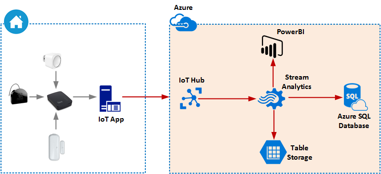
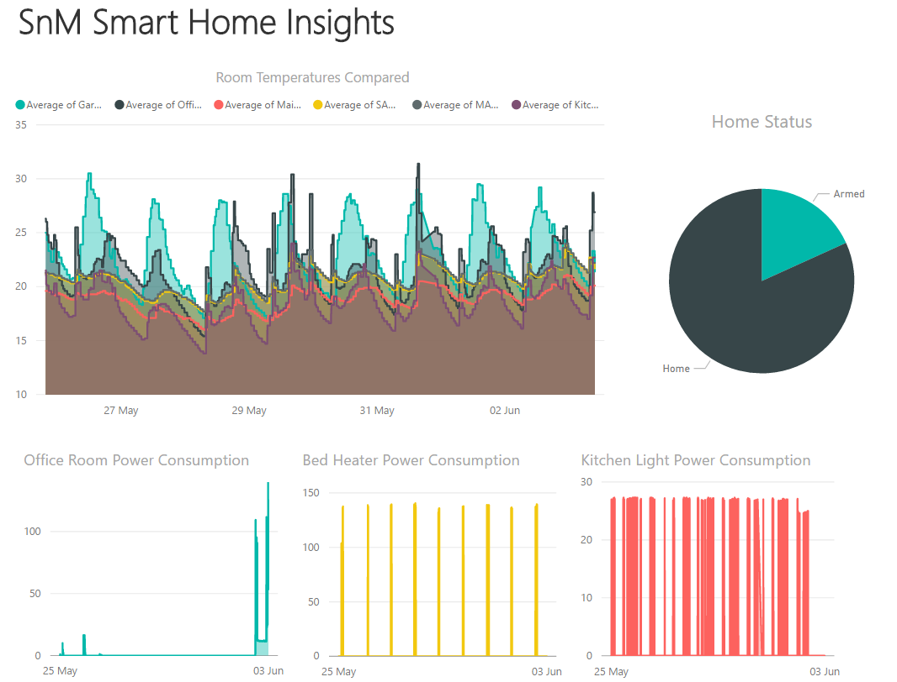
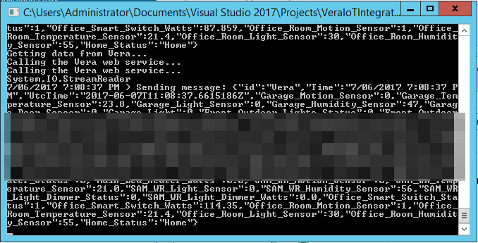

# Overview
This is a .Net C# written application that integrates with Vera Hub (VeraEdge or VeraLite) and Azure IoT. This application can be used to upload your home insights gathered through Vera to Azure Platform. It can then be stored in a PowerBI, Azure Storage Table or Azure SQL Database. The final solution can be illustrated as below. 



The final dashboards can be customized by using PowerBI. An example dashboard is below.



# Prerequisites
To achieve the complete solution illustrated above, you need the following:

1. Vera Controller
2. A few Sensors
3. An Azure Subscription

# Running the Application
This repository has the full source code of the application available to you. If you don't want to modify the application, you can run the application that is located in the /bin/Debug/. Before you run the application, you need to modify the config file of the application. It defines several parameters for the application; such as, the devices file for vera devices and the IoT endpoint that you connect to. An example app setting values are below:

```
<appSettings>
    <add key="iotHubUri" value="XXX.azure-devices.net" />
    <add key="deviceKey" value="XXXXX" />
    <add key="deviceName" value="Vera" />
    <add key="veraip" value="10.1.1.150" />
    <add key="devicesFile" value="c:\VeraIoTIntegration\devices.csv" />
    <add key="frequency" value="45000" />
</appSettings>
```

Then you need to define the devices that you want to include in the application. To accomplish this, you need to edit the devices.csv file. Your Vera Device IDs can be found in the Vera Portal. An example devices.csv file is below. 

```
"device_id","device_name","device_type"
"46","Garage Motion Sensor","MotionSensor"
"47","Garage Temperature Sensor","TemperatureSensor"
"48","Garage Light Sensor","LightSensor"
"49","Garage Humidity Sensor","HumiditySensor"
"32","Garage Door Sensor","DoorSensor"
"21","Garage Light","HueLight"
"59","Front Outdoor Lights","FibaroDimmer"
"108","Office Smart Switch","SmartSwitch"
```
Once you have filled those information, then you can run the application. If the Application is running successfully, you will see the console something similar to below. 


# Setting up the Azure Platform
This solution require setting up of Azure IoT hub and Azure Stream Analytics. If you need assistance on setting up the Azure Platfrom for this, please visit my blog at https://sameeraman.wordpress.com. I have written some blog posts for the whole solution. 
